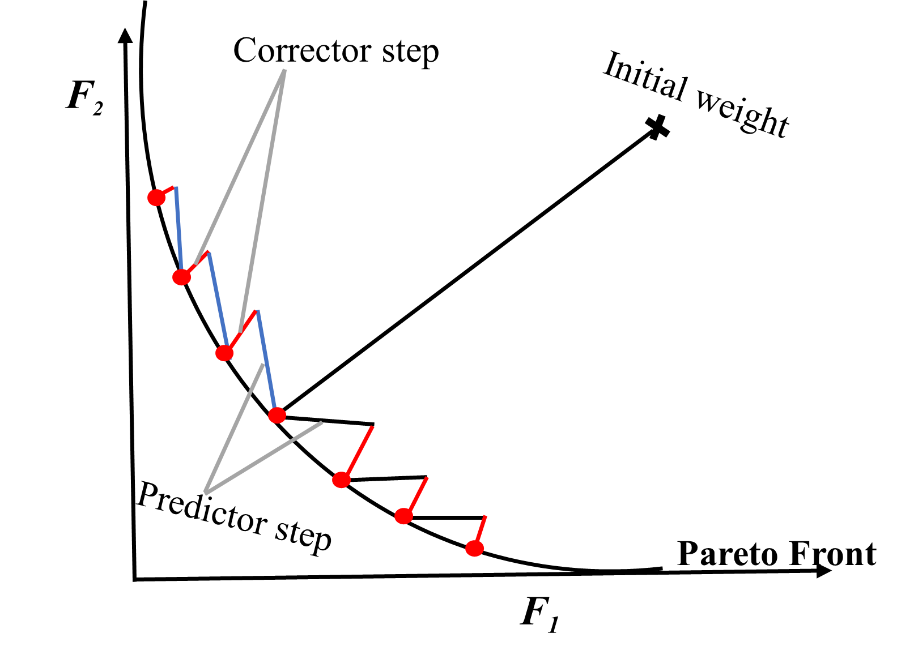

# Predictor-Corrector Algorithm
This repository contains the implementation of our algorithm (predictor-corrector (CM) algorithm) in used for efficiently finding Pareto optimal points (Pareto front) as detailed in our paper [[1]](#1) and its comparison with the weighted sum method and evolutionary algorithm.

## predictor-corrector folder: (Contains both the predictor-corrector and weighted sum algorithms for the mnist and iris datasets.)
### This file contains the following: 
* The predictor-corrector algorithm for the deterministic and stochastic approach on Iris and MNIST dataset respectively (plots).
* The Weighted-Sum Algorithm for the stochastic approach on MNIST dataset (plots).
* The comparison of both algorithms for the MNIST dataset (plots). 

    <figure>

  
  <figcaption>Figure 1: Sketch of the continuation method. The predictor steps are shown in black and blue for gradient and shrinkage steps respectively. The corrector step is shown in red.</figcaption>
</figure>

Note :
* While experimenting on our algorithm using the Iris dataset on deterministic setting, some specific configurations were made such as starting very close to zero.
* The main file is job.py
* Ensure you are in the right "directory" before compilation.

| Index | file_names | Description            |
| ----- | ----------- | ---------------------- |
| 1     | `configuration_iris.yaml`     | Contains the setting for the predictor-corrector algorithm Iris dataset.   |
| 2     | `configuration.yaml`     | Contains the setting for the predictor-corrector algorithm MNIST dataset.   |
| 3     | `continuationTest.py`     | Contains the training on MNIST and Iris datasets using the predictor-corrector algorithms.  |
| 4     | `DataLoader.py`     | Contains functions for processing and loading the datasets. |
| 5     | `functions.py`     | Contains the algorithm of the predictor-corrector method for the deterministic and  stochastic settings. |
| 6     | `helperFunctions.py`     | Contains help functions for modifying our predictor-corrector algorithm when needed.  |
| 7     | `job.py`     | This is the main file that compiles all the other files and return the different Pareto front plots (run this file to see results and plots).  |
| 8     | `OwnDescent.py`     | Contains our multiobjective proximal gradient optimizer class code.  |
| 9     | `perm.txt`     | Shuffled indices for the Iris dataset data loading. |
| 10     | `plotResults.py`     | Contains functions for various visualisations. |
| 11     | `weightedsumTest.py`     | Contains the weighted sum algorithm. |

### Results_reference 
This folder consists of results obtain to form a baseline, where we have executed Algorithm 2 using very small step sizes. Interestingly, the Pareto set and front consist of multiple components, which we were only able to find by repeated application of the continuation method with random initial conditions (multi-start).

### Results
This folder contains the outputs/results for:
1.  deterministic CM on Iris dataset (Results_cm_dt_iris). 
2.  stochastic CM on MNIST dataset (Results_cm_sto).
3. stochastic WS on MNIST dataset (Results_ws_sto).

### images
This is the folder where all the images plotted are saved.

### Packages
    * Python
    * Torch
    * Numpy
    * Scikit-learn (load data)
    * Matplotlib
    * Keras (load data)

# cifar10 folder: (Contains both the predictor-corrector and weighted sum algorithms for the CIFAR10 dataset.)

Note:
* All experiments on the CIFAR10 datasets were performed on GPU with Python 3.11.5. Details of the cluster specification can be seen in our paper.

| Index | file_names  | Description            |
| ----- | ----------- | ---------------------- |
| 1     | `cm_cifar10.py`     | Contains all the functions required to compile the predictor-corrector algorithm.  |
| 2     | `ws_cifar10.py`     | Contains all the functions required to compile the weighted sum algorithm.  |
| 3     | `plotResults.py`     | Contains functions for various visualisations.  |

### Results 
This folder contains the outputs/results for:
1. stochastic CM on CIFAR10 dataset (Results_cm_sto).
2. stochastic WS on CIFAR10 dataset (Results_ws_sto).
### images
This is the folder where all the images plotted are saved.

# EA folder: (Contains the files for the evolutionary algorithm used on the Iris- deterministic setting and MNIST dataset- stochastic setting.)

| Index | file_names  | Description            |
| ----- | ----------- | ---------------------- |
| 1     | `EA_Iris.ipynb`     | Jupyter notebook containing all the functions and parameters required to compile the evolutionary algorithm for Iris dataset. |
| 2     | `EA_mnist.ipynb`     | Jupyter notebook containing all the functions and parameters required to compile the evolutionary algorithm for MNIST dataset.  |
| 3     | `plotResults.py`     | Contains functions for various visualisations of the evolutionary algorithm and comparsions with predictor-corrector algorithm and weighted sum method. |

### Results
This folder contains the outputs/results as .txt files for:
1.  Iris in the weights (Iris_X_pareto_front) and objective (Iris_F_pareto_front) space.
2. MNIST in the weights (mnist_X_pareto_front) and objective (mnist_F_pareto_front) space.
### perm.txt
Shuffled indices for the Iris dataset data loading.
### images
This is the folder where all the images plotted are saved.

## References
<a id="1">[1]</a> 
Amakor, Augustina C., Konstantin Sontag, and Sebastian Peitz. "A multiobjective continuation method to compute the regularization path of deep neural networks." arXiv preprint arXiv:2308.12044 (2023).

<a id="2">[2]</a> 
Blank, Julian, and Kalyanmoy Deb. "Pymoo: Multi-objective optimization in python." Ieee access 8 (2020): 89497-89509.